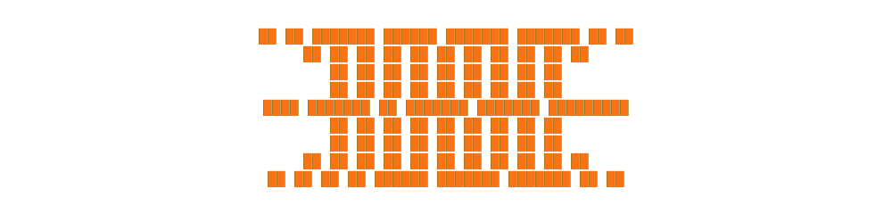

<div align="center">



`// ai/ml engineer · full-stack · building DreamHive & Tibbit`

</div>

<div align="center">


<br/><br/>

[](https://linkedin.com/in/krisshdiwedy38/)
[](https://instagram.com/krissh.diwedy)
[](https://x.com/@KDiwedy)
[](mailto:krisshdiwedy38@gmail.com)

<br/>


</div>

---

## `$ whoami`

```typescript
const krissh = {
  role      :  "AI/ML Engineer & Full-Stack Developer",
  projects  :  ["DreamHive 🐝", "Tibbit 🤖"],
  focus     :  ["AI-Powered SaaS","Impactful Products","LLM Engineering"],
  stack     :  ["Python", "FastAPI", "Django", "TypeScript", "React", "PostgreSQL", "Docker", "AWS],
  studying  :  "B.Tech CSE (AI & ML) — 4th Year",
  mindset   :  "Learn deep. Build real. Ship fast.",
  goal2026  :  "1,000+ Users, · Mobile app",
  openTo    :  ["AI/ML Collabs", "LLM Projects", "Research Opportunities"],
};
// currently: sharpening ML fundamentals + polishing projects
```

---

## 🧠 Tech Stack

<div align="center">

**◦ Languages ◦**
<br/>


**◦ AI / ML ◦**
<br/>


**◦ Backend & Database ◦**
<br/>


**◦ Tools & DevOps ◦**
<br/>


</div>

---

## 📊 Skill Matrix

```
Machine Learning / DL     ████████████████████░░  90%
Python & Data Science     ███████████████████░░░░  88%
Backend / APIs            █████████████████░░░░░░  80%
LLM Engineering / RAG     ███████████████░░░░░░░░  72%
Frontend Development      █████████████░░░░░░░░░░  65%
DevOps / Cloud            ████████████░░░░░░░░░░░  60%
```

---

## 🗺️ 2026 Roadmap

```
Q1 2026  ████████████████████  ✅  End-sem prep · SGPA 8.5 target
Q2 2026  ████████████░░░░░░░░  🔨  Polish DreamHive & Tibbit for applications
Q2 2026  ████████░░░░░░░░░░░░  🔨  Big Tech interview prep (DSA + ML)
Q3 2026  ░░░░░░░░░░░░░░░░░░░░  🎯  Internship / Research role secured
Q3 2026  ░░░░░░░░░░░░░░░░░░░░  🎯  GRE + SOP drafts for grad school apps
Q4 2026  ░░░░░░░░░░░░░░░░░░░░  🌍  Grad school applications — international
```

---

## 💡 Currently Learning

<div align="center">


</div>

```typescript
const currentlyLearning = {
  focus    : ["Advanced RL", "LLM Engineering", "System Design"],
  building : "DreamHive + Tibbit — polishing for big tech & grad apps",
  goal     : "Crack a top AI/ML role or land a strong grad school offer 🎯",
};
```

---

## 🤝 Let's Connect

<div align="center">

> Into **AI/ML**, **LLMs**, or **building useful things**?
> Always open to ideas, collabs, and feedback. Reach out anywhere below.

<br/>

[](https://linkedin.com/in/krisshdiwedy38/)
[](https://instagram.com/krissh.diwedy)
[](https://x.com/@KDiwedy)
[](mailto:krisshdiwedy38@gmail.com)

</div>

---

<div align="center">


</div>
